## Descripción del proyecto:

En esta práctica vamos a replicar las prácticas 2.1 (Apache) y 2.2 (nginx) usando contenedores Docker

- Apache: Servir un sitio estático desde la imagen oficial httpd:2.4, mapeando puertos y montando el sitio como bind mount.
- Nginx: Servir el mismo sitio estático montándolo como bind mount y usando un server block propio.

## Pasos seguidos para la instalación y despliegue. Capturas de pantalla del proceso: configuración, comprobaciones, estructura de archivos, página cargada y navegación. 

1. Actualizar la maquina virtual:

    - sudo apt update:
    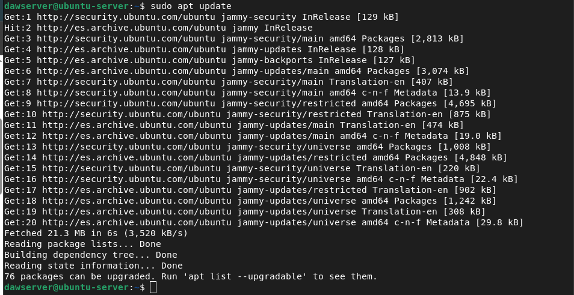

2. Instalación de Docker:

    - sudo apt install docker.io -y:
    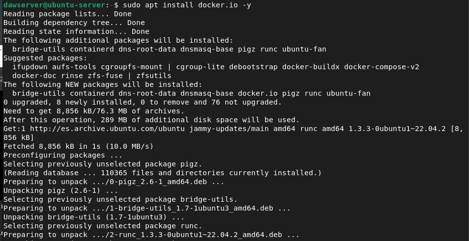

    - sudo systemctl start docker:
    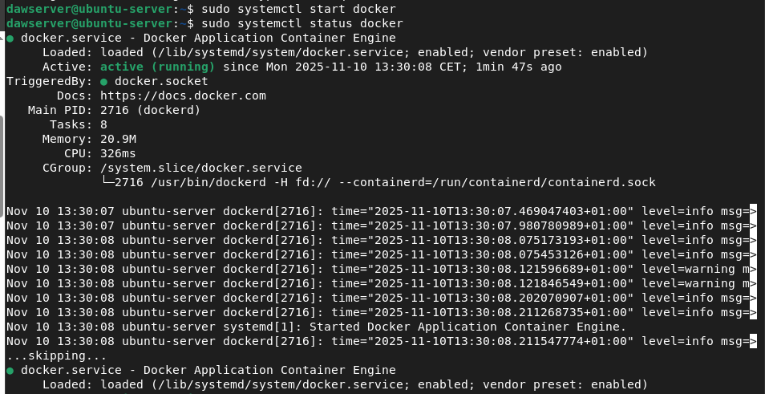

    - sudo systemctl enable docker y sudo usermod -aG docker $USER:
    

    - sudo apt install docker-compose -y:
    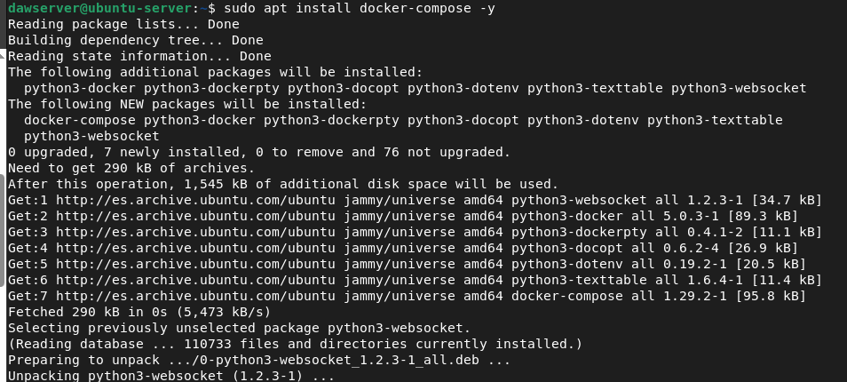

3. Levantar Apache y Nginx con Docker:

    - Apache:
    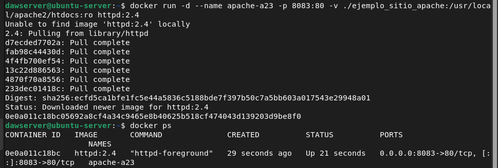

    - Nginx:
    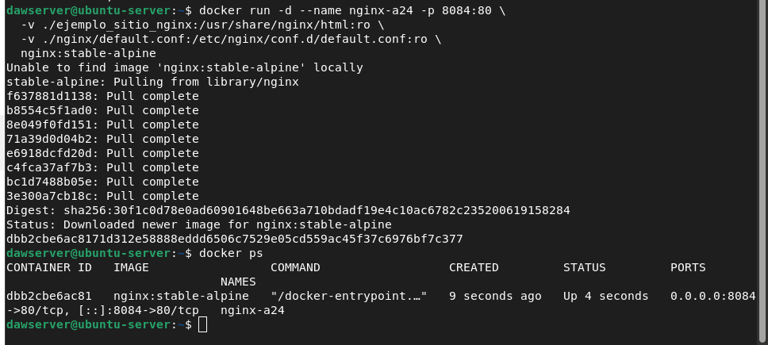

4. Verificar:

    - Apache Logs:
    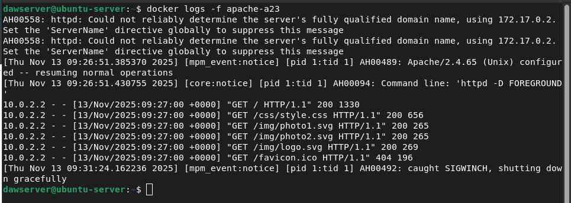

    - Nginx Logs:
    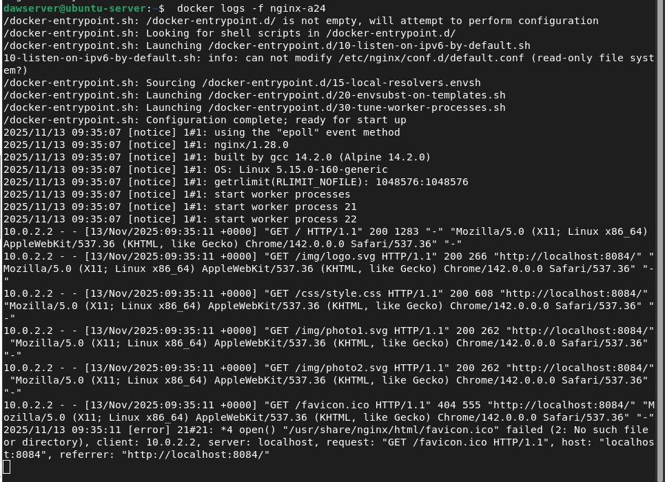

5. Alternativamente, usar Docker Compose.

    - Crea docker-compose.yml:
    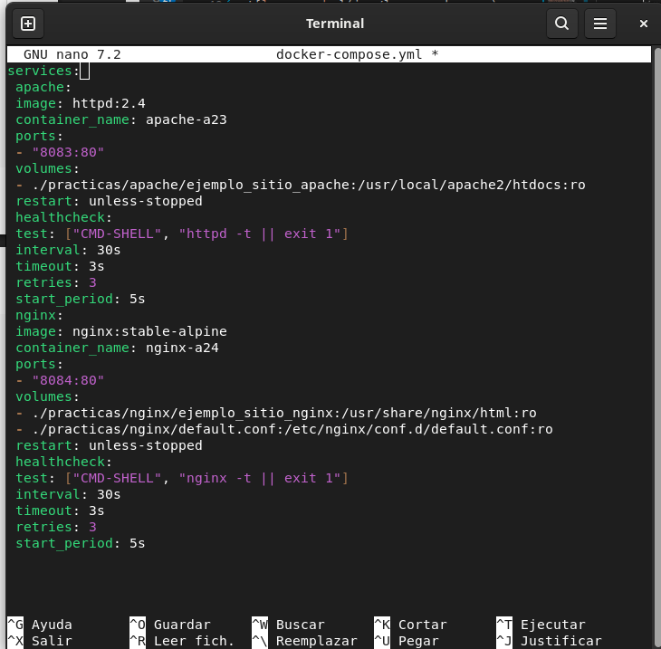

    - Verificar:
    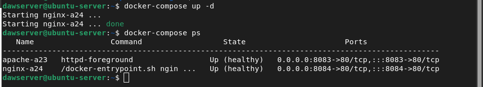

## Incluye captura de los contenedores en ejecución, del contenido del sitio servido tanto dentro de la VM (comando curl o wget) como desde el host (navegador).

Contenedores en ejecución: 
    

Curl:
- En la maquina virtual:
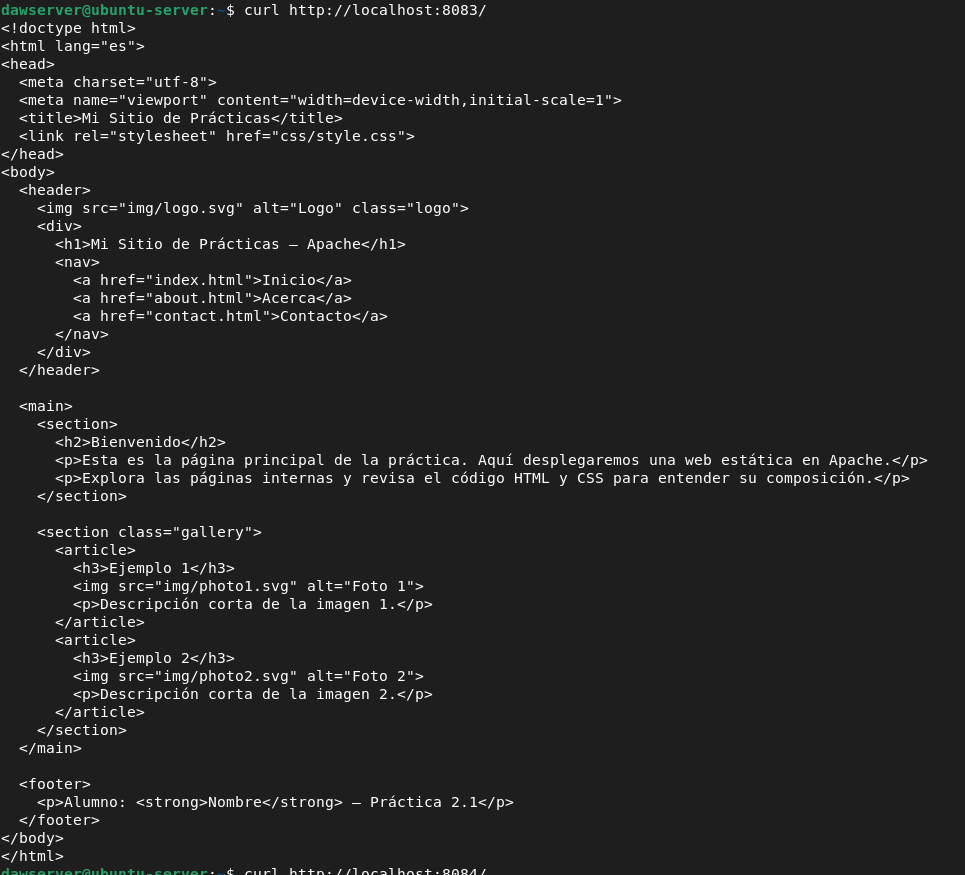
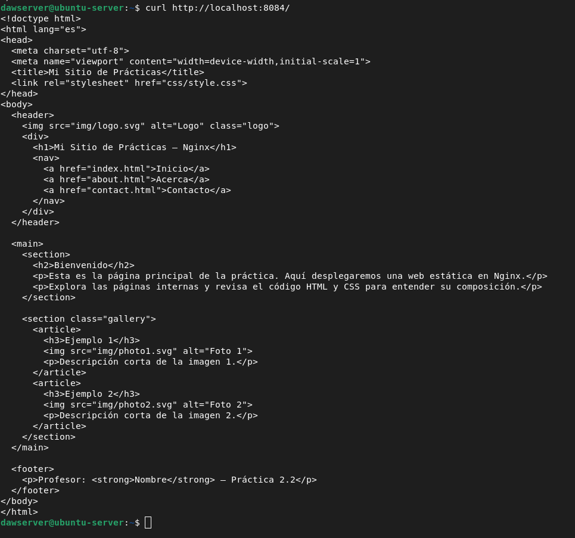

- En el host:
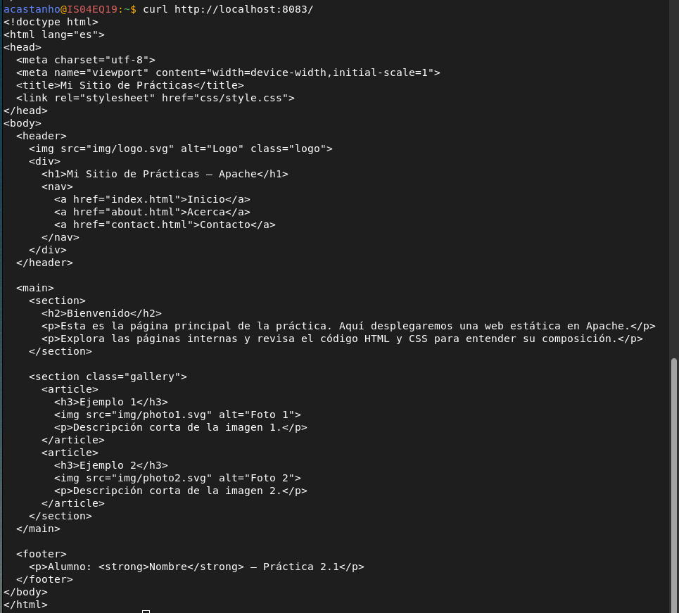
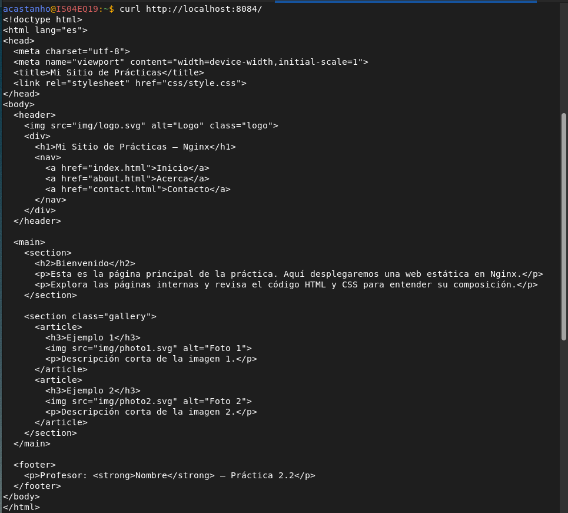

Wget:
- En la maquina virtual:
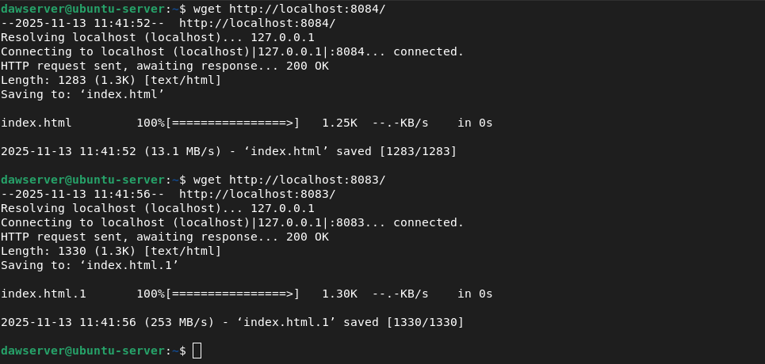
- En el host:
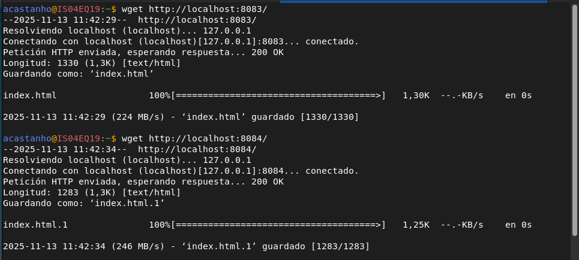

- Desde el navegador:
    - apache:
    

    - nginx:
    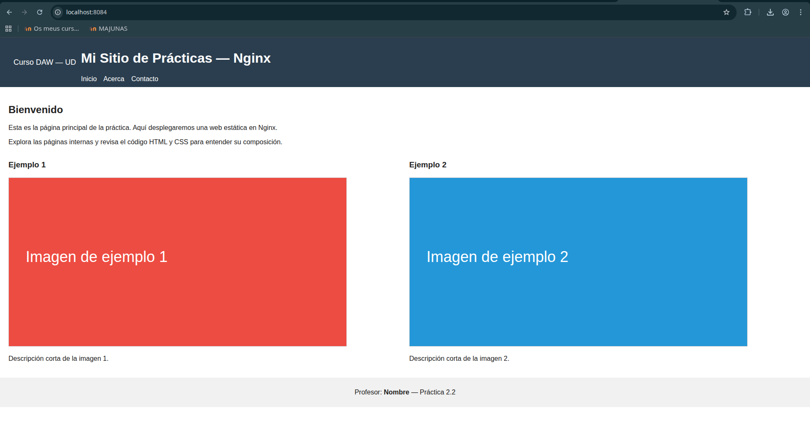

## Problemas encontrados durante la configuración y despliegue, y cómo los solucionaste. 

El problemas fue que no me cargaban las páginas desde el navegador del host. La solución fue crear reglas para apache y nginx para acceder a las páginas.

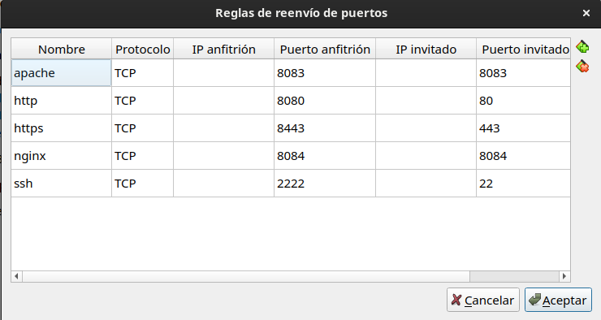

